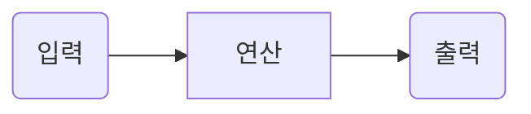

1. [NeoLAB Data Platform 이란?](https://github.com/NeoSmartpen/neolab-data-platform/wiki/1.-About)
2. [인증](https://github.com/NeoSmartpen/neolab-data-platform/wiki/2.-Authentication)
3. [서비스](https://github.com/NeoSmartpen/neolab-data-platform/wiki/3.-Service)  
   - [Inkstore](https://github.com/NeoSmartpen/neolab-data-platform/wiki/4.-Inkstore)  
   - [Paperhub](https://github.com/NeoSmartpen/neolab-data-platform/wiki/5.-Paperhub)  

