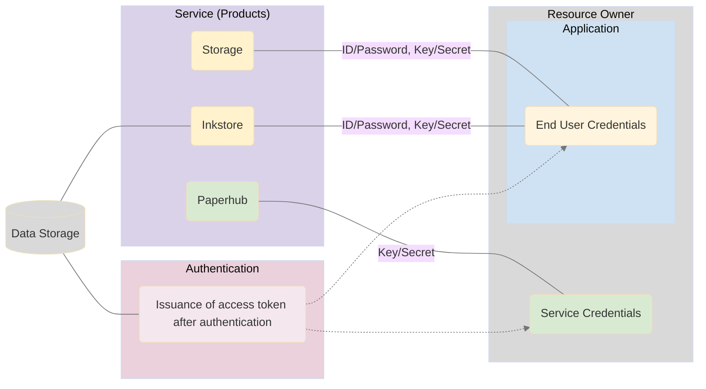

###### 개요

NeoLAB Data Platform(이하 NDP)은 NeoLAB의 기술을 활용하여 편리하고, 효과적으로 서비스를 개발할 수 있는 기능을 제공합니다.  
NDP의 주요 기능은 다음과 같습니다.

```markdown
- 서비스 개발을 위한 REST API를 제공합니다. 
- 펜 데이터, 서식 데이터 등 주요 리소스의 저장 공간을 제공합니다.
- NDP의 리소스를 사용할 수 있도록 권한을 부여하고, 인증합니다.
```

이 문서를 통해 NDP의 전체 구조와 주요 용어, 리소스를 사용하기 위한 인증 절차, 각 서비스가 제공하는 기능을 이해할 수 있습니다.


###### 전체 구조도

<!-- generated by mermaid compile action - START -->

<details>
  <summary>Mermaid markup</summary>



</details>
<!-- generated by mermaid compile action - END -->
###### 용어 · 요소 설명

* **리소스오너**  
리소스오너는 NDP에서 제공하는 서비스와 리소스에 접근하고 사용할 수 있는 권한을 갖는 주체입니다. 리소스오너는 한 명의 개발자나 여러 명의 개발자가 소속되어 있는 개발사가 될 수 있습니다.리소스 오너가 되기 위해서는 NDP의 Developer Center에 가입하여야 합니다. 

* **애플리케이션(프로젝트)**  
NDP의 서비스를 사용하려면 NDP Developer Center에 리소스오너로 가입한 후, 애플리케이션을 등록해야 합니다. 개발하려는 애플리케이션의 여러가지 정보를 입력하고, 이에 대한 검증을 거쳐야 합니다.기본적으로 해당 애플리케이션의 리소스 내에서만 접근할 수 있으며, 다른 애플리케이션의 리소스에는 접근할 수 없습니다.  

* **서비스**  
NDP의 서비스는 크게 다음과 같이 분류할 수 있습니다.  
(보다 자세한 설명은 [3. 서비스](https://github.com/NeoSmartpen/neolab-data-platform/wiki/3.-Service)에서 찾아볼 수 있습니다.)
  * **사용자(회원) 단위 서비스**  
    NDP의 몇 가지 서비스(Inkstore 등)는 사용자(회원) 단위로 제공됩니다. 즉, 이러한 서비스는 애플리케이션에 속해서 사용자(회원) 단위로 제공된다고 볼 수도 있습니다.  해당 서비스는 사용자 인증을 거쳐 서비스 또는 리소스에 접근할 수 있습니다. 

  * **리소스오너 단위 서비스**  
    리소스오너가 직접 사용하는 서비스입니다. 
    해당 서비스는 서비스 인증을 거쳐 서비스 또는 리소스에 접근할 수 있습니다.
